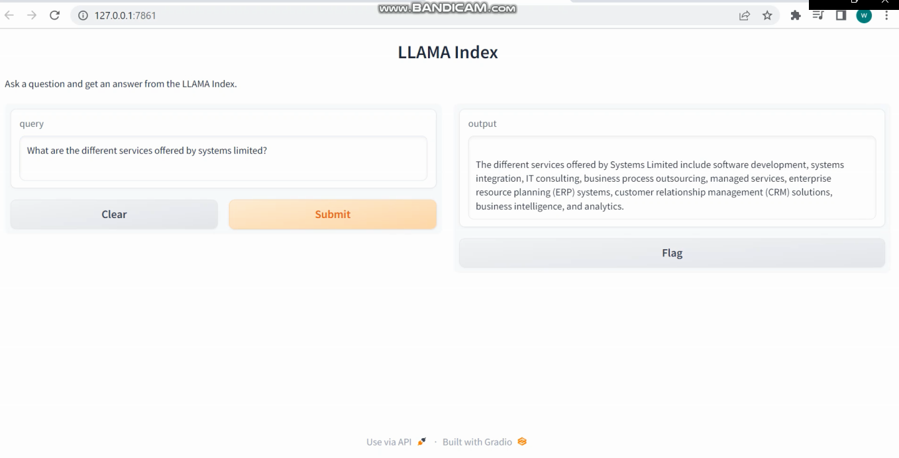

# ChatBot By OpenAI: Document-based Question Answering

Welcome to our ChatBot, powered by LlamaIndex and LangChain's ChatModel called ChatOpenAI! This intelligent chatbot is designed to retrieve information and provide accurate answers from a given document. 

## Usage
To use the chatbot, simply input your questions or queries, and it will search the provided document for relevant information, returning responses.

## Problem statment

In response to the given problem statement, the objective was to develop a chatbot that leverages LlamaIndex and LangChain's ChatOpenAI model for document-based question answering. The chatbot allows users to input questions and retrieve accurate answers from a provided document.

## Technical route

The technical route to this chatbot involved using LlamaIndex and LangChain's ChatOpenAI model. The chatbot utilizes the gpt-3.5-turbo model for question answering. The document corpus is indexed using GPTSimpleVectorIndex, and a prompt helper and LLMPredictor optimize input size and response generation. The chatbot is exposed through a Gradio interface, enabling users to input questions and obtain answers from the LlamaIndex.

## Output

The chatbot's output provides contextually accurate answers to user queries based on the provided document. Users can expect concise and relevant responses that address their specific questions. The chatbot leverages advanced natural language processing techniques and the power of the gpt-3.5-turbo model to deliver high-quality answers, enhancing the overall user experience.

